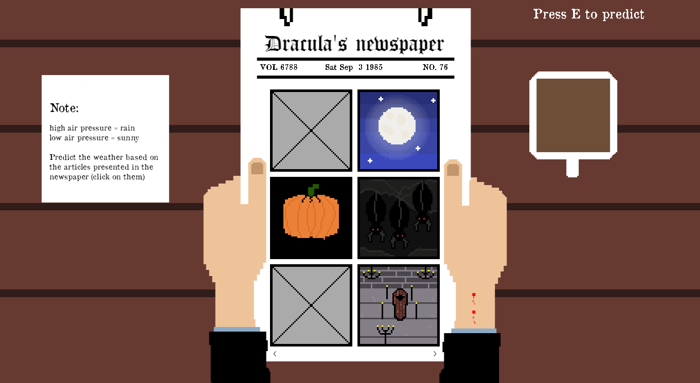

# Draculas-Meteorologist
olcCodeJam Entry
Game made in 3 days in OpenGL.
The year is 1895. You've been recently hired as the newest meteorologist at Dracula's Newspaper in Transylvania. 
You have one job, predict the weather based on the signs that you find in the current article. Otherwise you'll have to face the consequences.

# How to build
Run GenerateProject.bat

# How to play
Press the right and left arrow to navigate through pages.

# Screenshots

